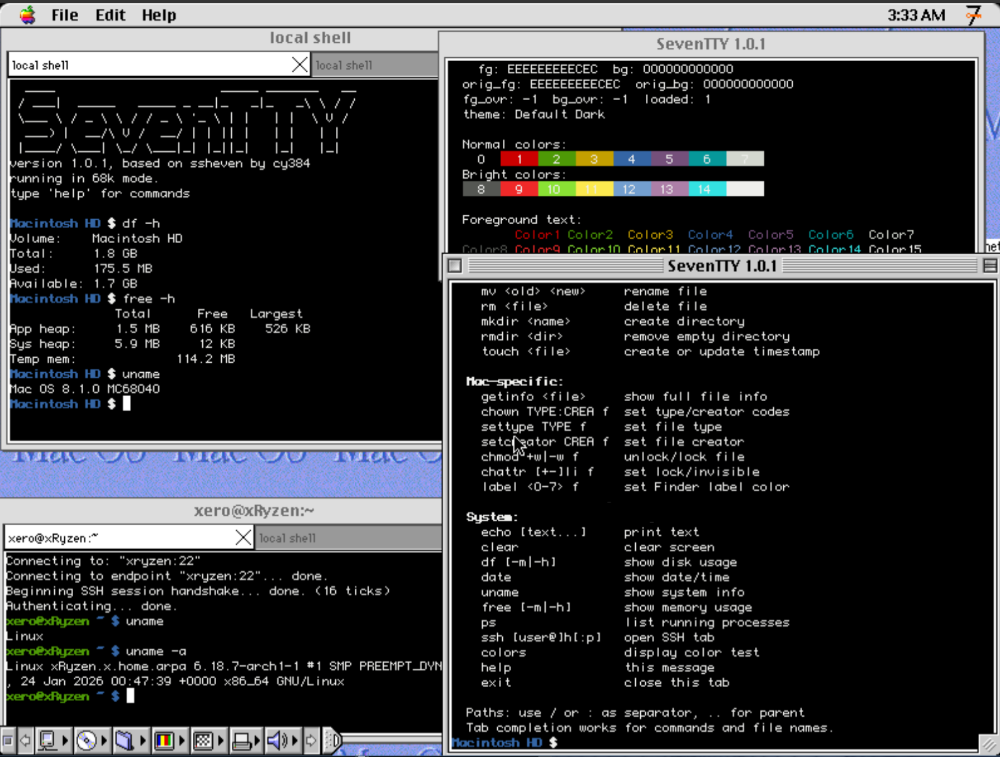

SevenTTY
========
SSH client, local shell, and terminal emulator for classic Mac OS 7/8/9.

A fork of [ssheven](https://github.com/cy384/ssheven) by cy384, expanded into a full-featured terminal environment.



features
--------
* **Multi-window**: Cmd+N opens independent windows, each with their own tabs
* **Tabbed sessions**: Cmd+T for local shell tabs, Cmd+S for SSH tabs, Cmd+1-8 to switch
* **Local shell**: built-in command interpreter with 30+ commands
  * File operations: `ls`, `cd`, `cat`, `cp`, `mv`, `rm`, `mkdir`, `touch`, and more
  * System info: `ps`, `free [-h]`, `df [-m|-h]`, `uname`, `date`
  * Mac-specific: `getinfo`, `chown`, `settype`, `setcreator`, `chmod`, `label`
  * Tab completion, command history (up/down arrows), colorized `ls` output
* **SSH client**: password and public key authentication, known hosts verification
* **Scrollback**: Shift+Page Up/Down to scroll through history (100 lines per session)
* **Copy/paste**: mouse text selection with Cmd+C/V
* **Telnet & raw TCP**: `telnet host [port]` opens in a new tab; `nc host port` for raw TCP inline
* **256-color & true-color**: xterm-256color with RGB support via Color QuickDraw, bold, italic, underline, reverse video
* **Symbol font**: custom bitmap font for box drawing, block elements, shading, and geometric shapes — seamless rendering at all font sizes
* **Color themes**: load iTerm2-compatible `.sttheme` files, or use built-in Dark (Tango) and Light palettes
* **Configurable**: font size, display mode (color/monochrome), foreground/background colors, prompt color, terminal type string

system requirements
-------------------
* **CPU**: any PPC processor, or at least a 68030 (68040 strongly recommended)
* **RAM**: 2 MB
* **Disk**: fits on a floppy
* **System**: 7.1 or later (versions below 7.5 require the Thread Manager extension)
* **Network**: Open Transport required for SSH (local shell works without it)

keyboard shortcuts
------------------
| Shortcut | Action |
|----------|--------|
| Cmd+N | New window |
| Cmd+T | New local shell tab |
| Cmd+S | New SSH tab |
| Cmd+W | Close tab/window |
| Cmd+D | Disconnect SSH / close tab / quit |
| Cmd+K | Connect (SSH) |
| Cmd+1-8 | Switch tabs |
| Cmd+C/V | Copy/paste |
| Shift+PgUp/PgDn | Scroll through history |

color themes
------------
SevenTTY supports custom color palettes via `.sttheme` files (16 ANSI colors plus background, foreground, and cursor). Use the **Preferences → Theme...** button to load a theme, or select the built-in **Dark** (Tango palette) or **Light** modes.

To convert an iTerm2 color scheme:

```bash
python3 tools/itermcolors2sttheme.py MyTheme.itermcolors > MyTheme.sttheme
```

Copy the `.sttheme` file to your Mac and load it from the preferences dialog. The theme persists across launches.

Hundreds of iTerm2 themes are available at [iterm2colorschemes.com](https://iterm2colorschemes.com/).

build
-----
Requires [Retro68](https://github.com/autc04/Retro68/) with Universal Headers and cmake.

Dependencies (mbedtls, libssh2, libvterm) are pulled in as submodules and built automatically.

```bash
mkdir build-m68k && cd build-m68k
cmake .. -DCMAKE_TOOLCHAIN_FILE=/path/to/Retro68-build/toolchain/m68k-apple-macos/cmake/retro68.toolchain.cmake
cmake --build . --parallel $(nproc)
```

The script `build-fat.bash` can also be used to build a fat binary.

license
-------
Licensed under the BSD 2 clause license, see `LICENSE` file.

Based on ssheven by [cy384](https://github.com/cy384/ssheven).
